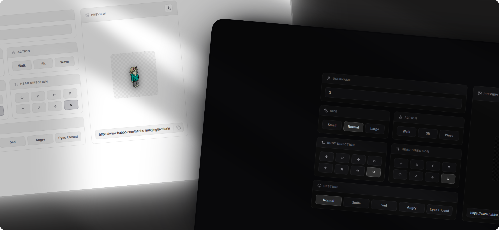

<div align="center">
  
  </div>

# Habbo Imager

React + TypeScript component and demo showcase to generate, customize, and download Habbo avatars using the official Habbo Imaging API.

## Features

- **Customizer:** Username, size, actions (walk/sit/wave), gestures, and 8-direction angles.
- **Link:** Instant clipboard copy.
- **Save:** Native avatar download trigger.

## How to?

1. Install required icon library:
   ```bash
   npm install lucide-react
   ```

2. Copy the [`src/components/HabboImager`](./src/components/HabboImager) folder into your project's `components/` directory.

3. Import and use:
   ```tsx
   import { HabboImager } from './components/HabboImager';

   export default function App() {
     return (
       <HabboImager 
         initialUsername="3"
         initialSize="l"
         onUrlChange={(url) => console.log('Avatar URL:', url)}
       />
     );
   }
   ```

## Local Development

Run the demo site locally:

```bash
npm install
npm run dev
```

Build for production:

```bash
npm run build
```

## License

MIT — Feel free to use, modify, and build on this project for whatever you want.
